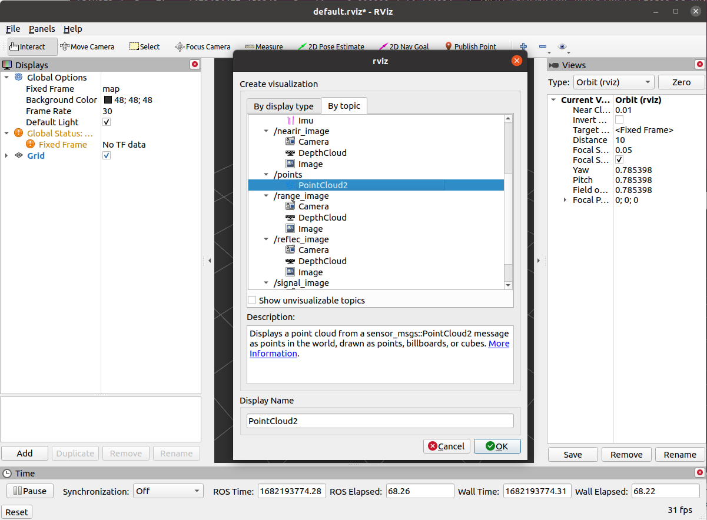

# 03_ros_param_launch_bag

# How to run

```
# compile the package
catkin_make --only-pkg-with-deps 03_ros_param_launch_bag
# setup environment
source devel/setup.bash
# try demo 1-10:
roslaunch 03_ros_param_launch_bag demo01.launch
roslaunch 03_ros_param_launch_bag demo02.launch
roslaunch 03_ros_param_launch_bag demo03.launch
roslaunch 03_ros_param_launch_bag demo04.launch
roslaunch 03_ros_param_launch_bag demo05.launch
roslaunch 03_ros_param_launch_bag demo06.launch
roslaunch 03_ros_param_launch_bag demo07.launch
roslaunch 03_ros_param_launch_bag demo08.launch
roslaunch 03_ros_param_launch_bag demo09.launch
roslaunch 03_ros_param_launch_bag demo10.launch
```

## ROSBAG

Download the example bags from: 

[https://drive.google.com/drive/folders/1T9Kuong6kwf5c3I6yxSE8GP2JfGTGSB7?usp=sharing](https://drive.google.com/drive/folders/1T9Kuong6kwf5c3I6yxSE8GP2JfGTGSB7?usp=sharing)

```
# Check the rosbag info 
rosbag info 2023-01-13-16-34-37.bag
# play rosbag 
rosbag play --pause 2023-01-13-16-34-37.bag
```

In another terminal, launch RVIZ by:

```
# launch rviz 
rviz
```

You should be able to see:


Click "Add" button at the left bottom corner:



Add the `points/PointCloud2` and change the `Fixed Frame` from `map` to `os_sensor`


Click the `PointCloud2` at the `Displays` windows and change the `size` from `0.01` to `0.1`:


Play the rosbag by press "space" keyboard, you should be able to see something similar as follows:


