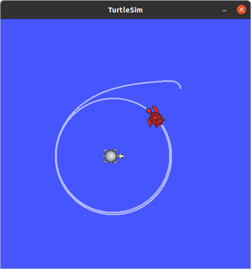

# 04_ros_tf

## How to use

```
# launch a turtle circle node
roslaunch 04_ros_tf circle.launch
```

You should see the following:



```
# launch a turtle follow node
roslaunch 04_ros_tf follow.launch
roslaunch 04_ros_tf follow2.launch
```

You should see the following:


```
# launch a turtle follow node
roslaunch 04_ros_tf convoy.launch
```

You should see the following:


